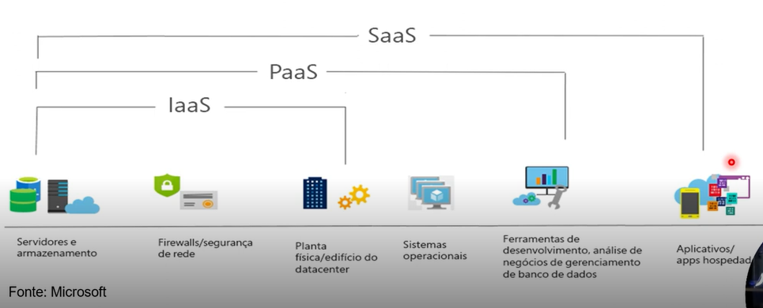
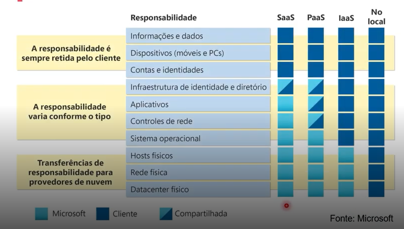
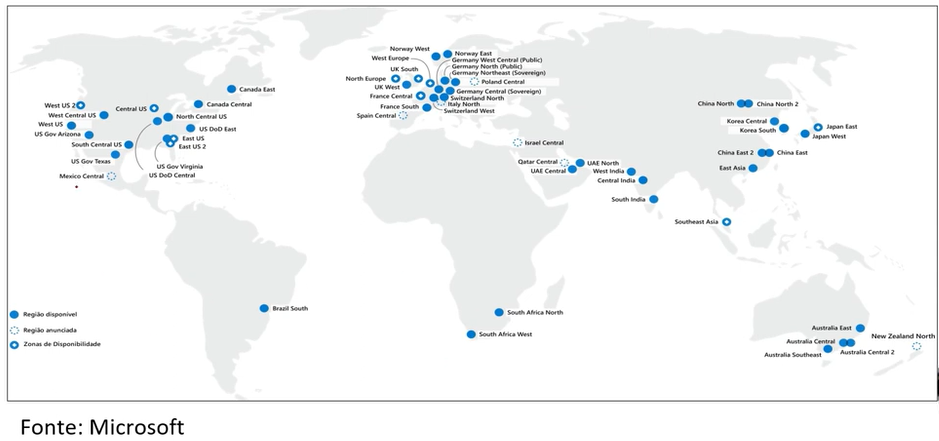
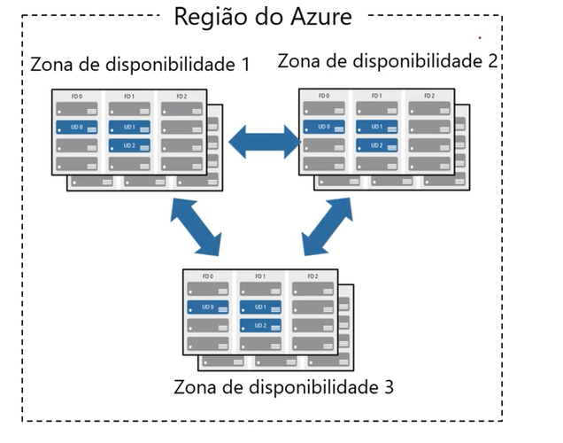
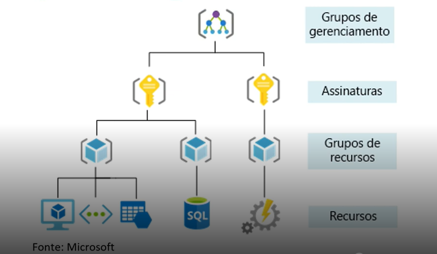
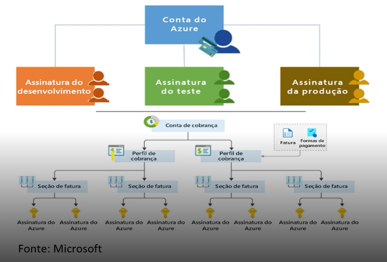
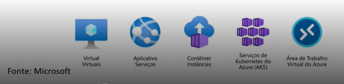
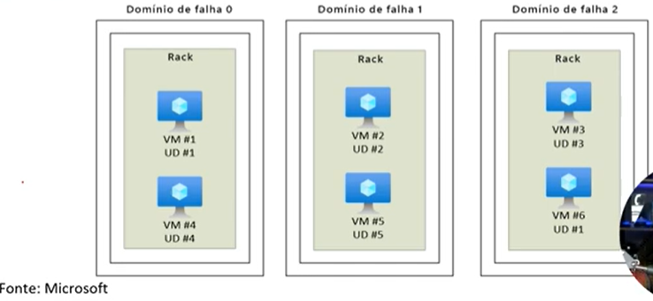

# laboratorio-dio
Repositório para realizar atividades educacionais da DIO referente a AZ-900

---

📘 AZ-900 – Fundamentos de Cloud (Microsoft Azure)

Este repositório foi criado com o objetivo de registrar estudos e atividades práticas realizadas durante o curso preparatório para a certificação AZ-900 – Microsoft Azure Fundamentals.

Durante o desenvolvimento deste material, foram abordados conceitos fundamentais relacionados à computação em nuvem, incluindo:

---

## 📘 Módulo 1 – Conceitos de Cloud

---

### ☁️ Modelos de Nuvem
- Nuvem Pública  
- Nuvem Privada  
- Nuvem Híbrida  
- Diferenças, vantagens e cenários de utilização de cada modelo  

---

### 💰 Modelos de Custos em Cloud
- Conceito de CAPEX (Capital Expenditure)  
- Conceito de OPEX (Operational Expenditure)  
- Comparação entre custos tradicionais de infraestrutura e custos em computação em nuvem  

⚠️ Dica de prova:
CAPEX = investimento inicial alto  
OPEX = pagamento conforme uso  

---

### ⚙️ Assinaturas e Recursos no Azure
- Processo de criação de assinaturas  
- Organização e gerenciamento de recursos no Azure  
- Estrutura básica de governança na plataforma  

---

### 🚀 Benefícios da Computação em Nuvem

**Alta Disponibilidade**  
Serviços em nuvem oferecem altos níveis de SLA (Service Level Agreement), como 99%, 99,5% e 99,99%, garantindo maior tempo de disponibilidade. Em casos de descumprimento, pode haver compensações financeiras (estornos).

**Exemplo:**  
99% → ~7 horas de indisponibilidade/mês  
99,9% → ~43 minutos/mês  
99,99% → ~4 minutos/mês  

⚠️ Dica de prova:  
Alta disponibilidade NÃO significa zero downtime  

---

**Escalabilidade**  
Capacidade de aumentar ou reduzir recursos conforme a demanda, permitindo atender crescimento do sistema sem necessidade de investimento antecipado em infraestrutura.

---

**Elasticidade**  
Permite que os recursos sejam ajustados automaticamente para lidar com picos de uso inesperados, garantindo performance mesmo em situações não previstas.

⚠️ Dica de prova:  
Escalabilidade = planejado  
Elasticidade = automático  

---

**Segurança e Governança**  
Aplicação de políticas de acesso, controle de identidade e permissões, garantindo que apenas usuários autorizados tenham acesso aos recursos.

---

**Confiabilidade**  
Infraestrutura distribuída globalmente, com redundância e tolerância a falhas, garantindo maior estabilidade e continuidade dos serviços.

---

### 🧩 Tipos de Serviços em Cloud

**Infraestrutura como Serviço (IaaS)**  
Fornece recursos básicos de computação, como máquinas virtuais, redes e armazenamento. O usuário tem maior controle sobre o ambiente, sendo responsável por sistemas operacionais e aplicações.

➡️ Maior controle = mais responsabilidade  

---

**Plataforma como Serviço (PaaS)**  
Oferece um ambiente completo para desenvolvimento, testes e implantação de aplicações, sem a necessidade de gerenciar a infraestrutura.

➡️ Equilíbrio entre controle e facilidade  

---

**Software como Serviço (SaaS)**  
Disponibiliza aplicações prontas para uso via internet, sem necessidade de instalação ou gerenciamento técnico por parte do usuário.

➡️ Apenas uso da aplicação  

⚠️ Dica de prova:
IaaS → VM  
PaaS → App Service  
SaaS → Office 365  

---

### 🔐 Modelo de Responsabilidade Compartilhada

Na computação em nuvem, a responsabilidade pela segurança e gerenciamento dos recursos é dividida entre o provedor de nuvem e o cliente.

#### 🧱 Infraestrutura como Serviço (IaaS)

**Responsabilidade do Cliente:**
- Sistema operacional  
- Configurações de rede  
- Aplicações instaladas  
- Atualizações e patches  
- Dados  

**Responsabilidade do Provedor:**
- Datacenter físico  
- Hardware  
- Rede física  
- Virtualização  

➡️ Maior controle para o cliente, porém maior responsabilidade  

---

#### ⚙️ Plataforma como Serviço (PaaS)

**Responsabilidade do Cliente:**
- Aplicações desenvolvidas  
- Configuração das aplicações  
- Dados  

**Responsabilidade do Provedor:**
- Sistema operacional  
- Runtime  
- Middleware  
- Infraestrutura  

---

#### 💻 Software como Serviço (SaaS)

**Responsabilidade do Cliente:**
- Dados  
- Configuração de uso  

**Responsabilidade do Provedor:**
- Todo o restante  

⚠️ Dica de prova:
Quanto mais alto (SaaS), menos responsabilidade do cliente  

---

## 📘 Módulo 2 – Arquitetura do Azure

---

### 🏗️ Arquitetura do Azure

A arquitetura do Microsoft Azure é baseada em uma estrutura global distribuída.

---

### 🌎 Regiões

As regiões são conjuntos de datacenters localizados em diferentes áreas geográficas ao redor do mundo.

---

### 🌐 Pares de Regiões

➡️ Região secundária para recuperação  
➡️ Evita indisponibilidade simultânea  
➡️ Ajuda em disaster recovery  

---

### 🏢 Zonas de Disponibilidade

Datacenters fisicamente separados dentro da mesma região.

⚠️ Dica de prova:
Zona ≠ Região  

---

### 🛠️ Gerenciamento de Recursos

Management Groups → Subscriptions → Resource Groups → Resources  

---

### 📦 Assinaturas

➡️ Controle de cobrança  
➡️ Controle de acesso  

---

### 📁 Grupos de Recursos

➡️ Agrupamento lógico de recursos  
➡️ Gerenciamento em conjunto  

---

### 📌 Resumo

- Região → Local físico  
- Zona → Alta disponibilidade  
- Assinatura → Controle  
- Grupo → Organização  

---

## 💻 Computação e Rede no Azure

A computação no Azure é um serviço sob demanda que fornece recursos de computação, como discos, processadores, memória, rede e sistemas operacionais.

➡️ Permite criar, executar e escalar aplicações sem necessidade de infraestrutura física  

---

## 🖥️ Serviços de Computação

---

**Máquinas Virtuais (Virtual Machines – VM)**  
Permitem criar servidores completos na nuvem.

➡️ Controle total do ambiente  

⚠️ Dica:
VM = IaaS  

---

**Conjunto de Dimensionamento de Máquinas Virtuais (VMSS)**  
Permite criar e gerenciar múltiplas VMs com escalabilidade automática.

➡️ Ideal para aplicações com variação de carga  
➡️ Suporta balanceamento de carga  

⚠️ Dica:
VMSS = ESCALA  

---

**Conjunto de Disponibilidade (Availability Set)**  
Distribui VMs para garantir disponibilidade.

➡️ Protege contra falhas  

⚠️ Dica:
Não escala  

---

**Área de Trabalho Virtual (Azure Virtual Desktop)**  
É um serviço de virtualização de desktops que permite executar uma área de trabalho (Windows) na nuvem, acessível remotamente por qualquer dispositivo.

➡️ O usuário acessa um desktop completo via internet  
➡️ Não depende da máquina local (tudo roda na nuvem)  
➡️ Pode ser utilizado para trabalho remoto e ambientes corporativos  

⚠️ Dica de prova:
- Azure Virtual Desktop ≠ VM comum  
- É focado em experiência de usuário Final (desktop remoto), já a VM geralmente é usado para ser Servidor 

---

**Containers no Azure**  
Fornecem um ambiente leve e virtualizado para execução de aplicações, sem necessidade de gerenciar o sistema operacional. (PaaS)

➡️ Inicialização rápida e baixo consumo de recursos  
➡️ Portabilidade entre ambientes (dev, teste e produção)  
➡️ Podem escalar rapidamente conforme a demanda  

⚠️ Dica de prova:
- Containers ≠ Máquinas Virtuais  
👉 Containers são mais leves e rápidos  
👉 VM inclui sistema operacional completo  

---

**Instâncias de Contêiner (Azure Container Instances – ACI)**  
Permite executar containers de forma rápida e simples, sem necessidade de gerenciar servidores.

➡️ Provisionamento em segundos  
➡️ Ideal para cargas simples ou temporárias  
➡️ Cobrança baseada no uso  

⚠️ Dica de prova:
ACI = simples e direto  
👉 Sem orquestração  

---

**Aplicativos de Contêiner (Azure Container Apps)**  
Plataforma para execução de aplicações modernas baseadas em containers, com escalabilidade automática.

➡️ Suporte a microserviços  
➡️ Escala automática (inclusive para zero)  
➡️ Integração com eventos  

⚠️ Dica de prova:
Container Apps = intermediário  
👉 Mais completo que ACI  
👉 Mais simples que AKS  

---

**Azure Kubernetes Service (AKS)**  
Serviço gerenciado que permite implantar, gerenciar e orquestrar containers utilizando Kubernetes.

➡️ Gerencia automaticamente a infraestrutura do Kubernetes  
➡️ Permite escalar aplicações em containers conforme a demanda  
➡️ Suporta alta disponibilidade e balanceamento de carga  
➡️ Ideal para aplicações complexas e arquiteturas de microserviços  

⚠️ Dica de prova:
AKS = orquestração de containers  
👉 Mais completo e poderoso  
👉 Também mais complexo de gerenciar  

Comparação rápida:

- ACI → simples (executa container)
- Container Apps → escalável e moderno
- AKS → completo (orquestra tudo)

---
**Azure Functions (PaaS)**  
Serviço de computação sem servidor (serverless) que permite executar código baseado em eventos, sem necessidade de gerenciar infraestrutura.

➡️ Código é executado apenas quando acionado (event-driven)  
➡️ Não há necessidade de manter servidor ativo  
➡️ Ideal para automações, integrações e tarefas sob demanda  

⚠️ Dica de prova:
- Serverless ≠ sem servidor  
👉 O servidor existe, mas é gerenciado pelo Azure  

- Você paga apenas quando o código é executado  

Exemplos de uso:
- Processamento de arquivos ao subir no storage  
- Integração entre sistemas  
- Execução de tarefas agendadas 

---

**Serviço de Aplicativos do Azure (Azure App Service – PaaS)**  
Plataforma totalmente gerenciada para criar, implantar e dimensionar rapidamente aplicações web e APIs.

➡️ Não é necessário gerenciar servidores ou infraestrutura  
➡️ Suporte a várias linguagens (.NET, Java, Node.js, Python, etc.)  
➡️ Integração com banco de dados, autenticação e serviços do Azure  
➡️ Escalabilidade automática conforme a demanda  

⚠️ Dica de prova:
- App Service = PaaS  
👉 Foco no código, não na infraestrutura  

- Muito usado para:
  👉 APIs  
  👉 Sistemas web  
  👉 Back-end de aplicações  

 Comparação rápida:

- App Service → aplicação web  
- Functions → execução por evento  

---

## 🌐 Rede

---

---
** Rede Virtual (Azure Virtual Network – VNet)**

A VNet é o serviço de rede do Azure que permite criar uma rede privada na nuvem, semelhante a uma rede local (on-premises).

➡️ Permite comunicação segura entre recursos do Azure  
➡️ Isola recursos em uma rede privada  
➡️ Suporta comunicação com redes locais (VPN ou ExpressRoute)  

➡️ Dentro de uma VNet, é possível criar sub-redes (subnets) para organizar melhor os recursos  

**🔗 Emparelhamento de Redes (VNet Peering)**  
Permite conectar duas VNets diretamente, possibilitando comunicação entre elas como se estivessem na mesma rede.

➡️ Comunicação privada entre VNets  
➡️ Baixa latência e alta performance  
➡️ Não utiliza internet pública  

⚠️ Dica de prova:
- VNet = rede privada no Azure  
👉 Equivalente a uma rede interna (LAN)  

- Subnet = divisão da VNet  

- VNet Peering ≠ VPN  
👉 Peering é conexão direta dentro do Azure  
👉 VPN usa internet  

Exemplos de uso:
- Conectar API com banco de dados de forma segura  
- Isolar ambientes (produção, teste)  
- Integrar com rede local da empresa    

---
### 🔐 VPN Gateway

O VPN Gateway é um serviço do Azure que permite criar conexões seguras entre a rede do Azure (VNet) e redes externas, como a rede local da empresa ou dispositivos remotos.

➡️ Comunicação criptografada (segura)  
➡️ Conecta Azure com ambiente local (on-premises)  
➡️ Permite acesso remoto à rede do Azure  

**Site-to-Site (S2S)**  
➡️ Conecta a rede local inteira ao Azure  

**Point-to-Site (P2S)**  
➡️ Conecta dispositivos individuais (ex: notebook do usuário)  

⚠️ Dica de prova:
- VPN Gateway = conexão segura via internet  
👉 Usa criptografia  

- NÃO é conexão dedicada  
👉 Para conexão privada dedicada → ExpressRoute  

 Exemplos de uso:
- Empresa acessando sistemas no Azure com segurança  
- Funcionários acessando rede corporativa remotamente  
- Integração entre datacenter local e nuvem  

---

**⚡ ExpressRoute** 

O ExpressRoute é um serviço do Azure que permite criar uma conexão privada dedicada entre a rede local (on-premises) e o Azure, sem passar pela internet pública.

➡️ Conexão mais segura e estável  
➡️ Maior velocidade e menor latência  
➡️ Não utiliza a internet pública  

🔗 Características principais

➡️ Conexão dedicada (via operadora)  
➡️ Alta performance  
➡️ Alta confiabilidade  
➡️ Ideal para grandes empresas  

⚠️ Dica de prova:
- ExpressRoute ≠ VPN  

👉 VPN Gateway:
✔️ Usa internet  
✔️ Mais barato  
✔️ Mais simples  

👉 ExpressRoute:
✔️ Não usa internet  
✔️ Mais caro  
✔️ Mais rápido e estável  

Quando usar?

- Grandes volumes de dados  
- Sistemas críticos  
- Necessidade de baixa latência  
- Ambientes corporativos robustos  

----

**DNS do Azure (Azure DNS)**  

O Azure DNS é um serviço que permite hospedar e gerenciar domínios DNS no Azure, realizando a resolução de nomes para endereços IP.

➡️ Converte nomes de domínio (ex: www.site.com) em IPs  
➡️ Alta disponibilidade e desempenho global  
➡️ Gerenciamento simplificado de domínios  

⚠️ Dica de prova:
- DNS = resolução de nome → IP  

👉 Tipos:
- DNS Público → acessível pela internet  
- DNS Privado → utilizado dentro da VNet  

Exemplos de uso:
- Acessar aplicações pelo nome ao invés de IP  
- Comunicação interna entre serviços na rede  
- Configuração de domínios personalizados  